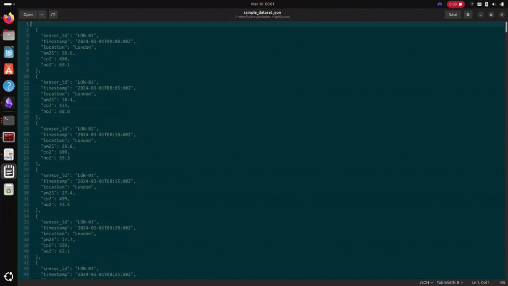

# PollutionMap

PollutionMap is a distributed data processing pipeline that processes air quality readings from sensors across multiple cities in parallel, producing a city-level pollution summary.

The air quality dataset is submitted to a central scheduler, which splits it into chunks and distributes them across multiple worker nodes that process them in parallel. This scheduler-worker approach scales horizontally: adding more workers reduces processing time proportionally. For a small dataset the difference is negligible, but for a dataset with millions of sensor readings from thousands of cities, splitting the work across multiple workers can be many times faster than running a single sequential script.

## 🎬 Demo



## ⚙️ How it works

1. A client submits a dataset to the scheduler
2. The scheduler partitions it into chunks and pushes tasks to a Redis queue
3. Multiple workers poll the queue and process their assigned chunks in parallel
4. Results are aggregated into a final output by a reduce stage

## 🛠️ Tech Stack

- **Python + FastAPI** — scheduler API
- **Redis** — task queue and distributed state
- **Docker** — each worker runs in its own container, making it easy to scale horizontally
- **HTTP REST** — communication between client, scheduler, and workers

## 🚀 Running Locally

**Prerequisites:** [Docker](https://docs.docker.com/get-docker/) must be installed and running.

**Start the scheduler and 3 workers:**
```bash
docker compose up --scale worker=3
```

**Submit a job:**
```bash
PYTHONPATH=. python -m client.submit_job dataset/sample_dataset.json 3
```

**Check live metrics (active workers, pending and running tasks):**
```bash
curl http://localhost:8000/metrics
```
